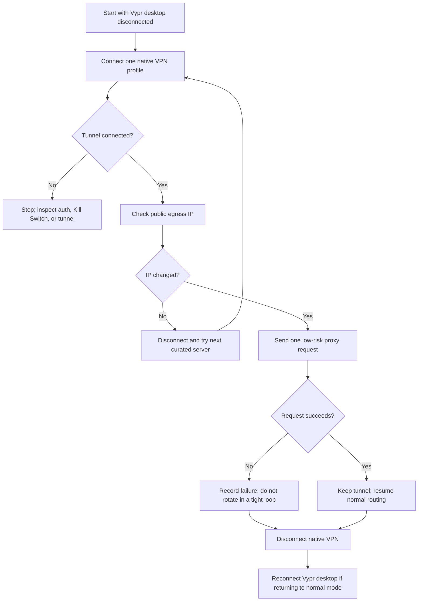
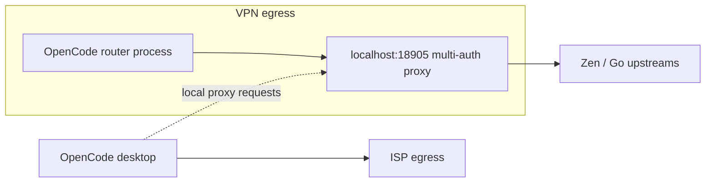

# VPN rotation spike — egress IP control on Windows (2026-09-08)

Why: the per-IP burst bucket is the dominant limiter on heavy days. Keys cover
quota; only a new egress IP clears burst. Goal: scriptable server hop that the
router (or an operator script) can trigger without touching samosa logic —
`localhost:18905` follows the OS default route, so any tunnel change applies.

## Local findings (this machine, 2026-09-08)

- **VyprVPN desktop 5.2.3 installed** (`C:\Program Files (x86)\VyprVPN`), GUI app
  `VyprVPN.exe` + services `VyprVPN`, `VyprVPNWireGuardTunnel` + adapters
  (`VyprWireGuard`, TAP `Local Area Connection`, `Ethernet 2`). Active use
  confirmed: connection log shows same-day hops
  (`lt1 → lv1 → cz1 → lt1.vpn.goldenfrog.com`, WireGuard, 6–13s connects).
- **No CLI surface**: `ServiceManager.exe` with no args only manages services
  (exits `ArgumentException`); control flows through `GoldenFrogIPC.dll`
  (proprietary IPC, no public spec).
- **Live WireGuard config on disk**:
  `C:\ProgramData\Certida LLC\VyprVPN\WG\VyprWireGuard.conf` — standard
  `[Interface]` + `[Peer]` (Address/DNS/Endpoint `IP:51820`,
  `AllowedIPs 0.0.0.0/1 + 128.0.0.0/1`). Rewritten by the app on every
  connect; only the CURRENT server's peer keys are present.
- **Server naming**: `{cc}{n}.vpn.goldenfrog.com` (`lt1`, `lv1`, `cz1`…);
  app fetches 73 locations via authenticated `CallLocationsApi`
  (`api.vyprvpn.com`) — no local server-list cache, no full URLs in logs.
- **Favorites/last servers** in `%LOCALAPPDATA%\Certida_LLC\…\user.config`
  (`lv1;lt1`) — display state only, cannot trigger a connect.
- **Bundled stock OpenVPN**: `OpenVPN\bin\openvpn.exe` + `ca.vyprvpn.com.crt`
  ship with the app, but no user `.ovpn` profiles exist anywhere on disk.
- **Cloudflare WARP**: service `WarpJITSvc` present but `warp-cli.exe` not found
  at the standard path — install state unverified, treat as lead not fact.

## Update 2026-09-08: official manual connections found — portal check unnecessary

VyprVPN publishes **manual setup for the Windows built-in client** (support docs,
still current — no portal download needed):

- **IKEv2 (preferred, fastest reconnects)**: `Settings → Network → VPN → Add VPN`
  with `Server name = xxN.vyprvpn.com`, `VPN type = IKEv2`,
  sign-in = Vypr **email + password**. Full public server list (70+ locations;
  nearby: `lt1`, `lv1`, `cz1`, `de1`, `pl1`).
- **L2TP/IPsec fallback**: same credentials + public pre-shared key
  `thisisourkey` + max-strength encryption.

No static IPs exist or are needed: the 300k-address dynamic pool is the ideal
rotation shape — every reconnect lands a fresh egress IP.

### Why this obsoletes the other paths

- **Locations API reuse**: unnecessary. Official credentials + hostnames beat
  reverse-engineering (no breakage risk, no ToS gray area). Kept as
  last-resort only.
- **Public scraping proxies (rejected outright, do not revisit)**:
  1. Key theft — Zen keys ride in `Authorization` headers through the proxy.
  2. Pre-burned — free proxy IPs are datacenter ranges, the worst class for
     per-IP limits. 3. SSE-hostile — flaky high-latency hops truncate 200K
     turns → more retries → more burst. Never route keyed traffic through
     untrusted middlemen.

## Detailed plan: scripted rotation via Windows native VPN

### Rotation flow

The flow deliberately verifies the egress address before using the proxy and
tests only after a tunnel is established. Run one tunnel at a time; do not
connect the desktop app and native profile concurrently.

### Optional two-lane topology

This split is only a hypothesis until per-app routing is verified: the router
process should use the VPN lane while direct desktop traffic uses the ISP lane.
If the desktop's requests go through the local proxy, those requests naturally
inherit the router process's VPN egress instead.

**Safety**: a native VPN profile lives in the Windows RAS phonebook + a
WAN Miniport adapter instance. It does not modify, remove, or reconfigure the
Vypr desktop app, its services, drivers, or configs. Rollback =
`Remove-VpnConnection`. **One tunnel at a time**: never run the Vypr app
connection and a native `rasdial` simultaneously (two default routes = stall;
recovery = disconnect either side). Credentials → Credential Manager, never
inline on the command line. Kill Switch caveat: if system-level, it can block
the native tunnel too — disable it for tests, re-enable after.

**Phase 1 — single manual connection, interactive (15 min):**

1. Disconnect/quit the Vypr desktop app.
2. `Add-VpnConnection -Name 'VyprVPN-lv1' -ServerAddress 'lv1.vyprvpn.com' -TunnelType Ikev2 -AuthenticationMethod Eap -RememberCredential`
   (credentials = Vypr email/password via prompt).
3. `rasdial VyprVPN-lv1` → `curl.exe https://api.ipify.org` (expect new IP) →
   one `(proxy)` turn → 200 on tape → `rasdial /disconnect` → reconnect app.
4. Failure branches: auth rejected → try username-form variants, then L2TP
   profile; connect hangs → suspect Kill Switch, disable and retry.

**Phase 2 — `scripts/vpn-hop.ps1` (in this repo):**

Loop over curated nearby servers (`lt1`, `lv1`, `cz1`, `de1`, `pl1`):
disconnect → `rasdial` next → verify `api.ipify.org` changed → optional ntfy
ping. Trigger: manual, Task Scheduler cadence, or dashboard button on the
tarpit signature (two consecutive multi-second 429s). Samosa needs zero
changes — `localhost:18905` follows the OS default route.

**Phase 3 — lane split (complementary, no new account):**

Vypr per-app exclusion ("Connection Per App"): keep `node.exe` (router daemon)
inside the tunnel, exclude the OpenCode desktop app so direct traffic
(main #1, `small_model`, direct `zen-2`) exits via the ISP IP. Two simultaneous
egress IPs: proxy pool (long sessions) on VPN IP, native lane (short/mid tasks)
on ISP IP. Validate: staggered burst onset between lanes.

## Constraints (unchanged)

- Rotation is an **egress-layer** concern; the router stays key-layer. No proxy
  code changes for any option above (worst case: a dashboard button that shells
  the hop script).
- Kill Switch fails in-flight requests during a hop — retry after reconnect.
